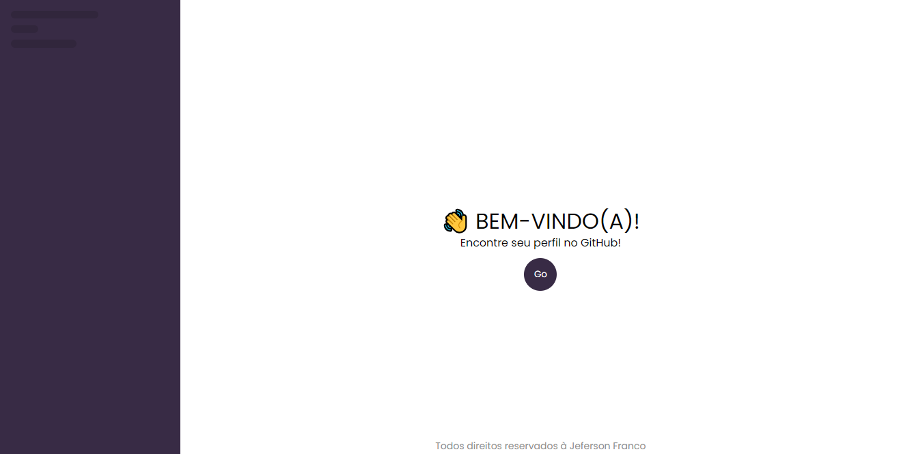
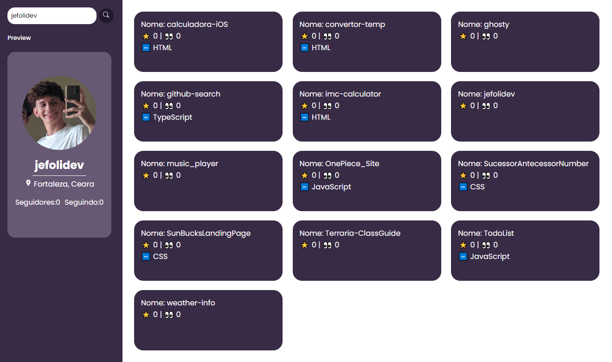

# 🐱‍👤| GitHub Repositories Search

 <p> Uma página que mostra informações relevantes sobre algum usuário e exibe também seu repositório. </b></p>

## Indice

- [Funcionaldiade do projeto](#Funcionalidade-do-projeto)
- [UI](#UI)
- [Executar projeto](#Como-rodar)
- [Tecnologias utilizadas](#Tecnologias-utilizadas)
- [Autor](#Autor)
- [Atualizações Futuras](#Atualizações-futuras)

## Funcionalidade do projeto

- [x] Mostrar informações sobre o perfil de algum usuário;
- [x] Detalhes sobre repositórios de uma determinada pessoa;
- [x] Site Responsivo.

## UI

<div align = "center">
    <h3> Página Inicial </h3>
    
    <h3> Página de Repositórios </h3>
    
</div>
<br>

## Como rodar o projeto

```bash
# Clone este repositório
$ git clone https://github.com/jefolidev/github-search.git

# Acesse a pasta do proejeto no terminal
# cd github-search

# Instale todas dependências
$ npm insall

# Execute a aplicação
```

## Tecnologias utilizadas

<div align = center>

</div>

## Autor

<div align = center>
 
 <p> <b> Jeferson Franco, Desenvolvedor Full Stack </b> </p> 
 <a style = "text-decoration: none;" href = "https://github.com/jefolidev">  </a>
 <a style = "text-decoration: none;" href = "https://www.linkedin.com/in/jeferson-franco-1349062b0/">  </a>
</div>

## Atualizações futuras

- Adicionar theme switcher;
- Fazer uma barra de pesquisa que filtra o nome dos repositórios.

